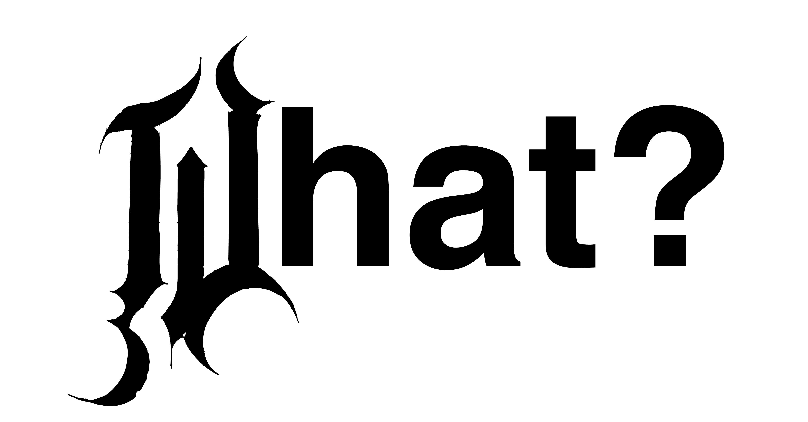
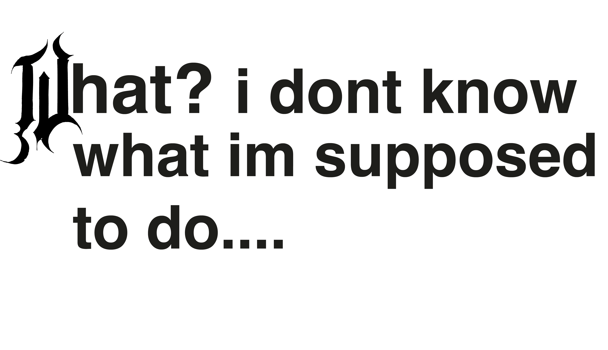
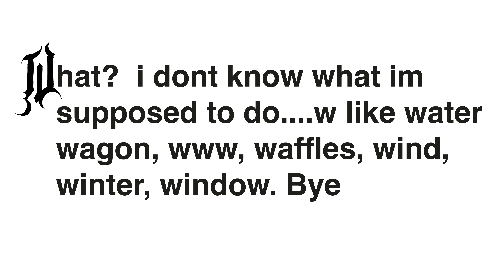

# Metadata & Preview Image Variations

## Variant 1
Title
What?

Description
A typographic preview focused on a single expressive word using a decorative initial letter.
)
Alt Text
The word “What?” set in bold black type with a decorative gothic-style letter W on a white background.

---

## Variant 2
Title
What? I don’t know what I’m supposed to do

Description
A typographic composition combining a decorative initial with a short sentence expressing confusion.

Alt Text
A short sentence starting with a decorative letter W, followed by bold sans-serif text on a white background.

---

## Variant 3
Title
What? I don’t know what I’m supposed to do

Description
A text-heavy typographic preview showing how expressive lettering scales with longer content.

Alt Text
A paragraph of black text beginning with a decorative letter W, followed by multiple words on a white background.

